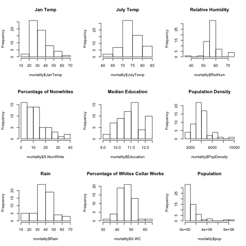

Does Pollution Affect Mortality?
========================================================
author: Adam Glover
date: 1/6/17
autosize: true

Introduction
========================================================
Researchers at General Motors collected data on 60 U.S. Standard Metropolitan Statistical Areas (SMSA's) in a study of whether air pollution contributes to mortality.


Summary of dataset
========================================================


```r
mortality <- read.csv('/Users/ag/Desktop/mortality.csv')
par(mfrow=c(3,3))
hist(mortality$JanTemp, main= "Jan Temp")
hist(mortality$JulyTemp, main= "July Temp")
hist(mortality$RelHum, main= "Relative Humidity") 
hist(mortality$Rain, main = "Rain")
hist(mortality$Mortality, main = "Mortality")
hist(mortality$Education, main = "Median Education")
hist(mortality$PopDensity, main = "Population Density")
hist(mortality$X.NonWhite, main = "Percentage of Nonwhites")
hist(mortality$X.WC, main = "Percentage of Whites Collar Workers")
```



Analysis of Dependent Variable
========================================================
The dependent variable is age adjusted mortality.

Age adjusting rates is a way to make fairer comparisons between groups with different age distributions.

- Low skewness and kurtosis values
- No need for transformation


```r
library('Hmisc')
library('psych')
hist(mortality$Mortality)
```


```r
describe(mortality$Mortality)
```

```
   vars  n   mean    sd median trimmed   mad    min     max  range skew
X1    1 60 940.35 62.22 943.68  940.04 65.66 790.73 1113.16 322.43 0.09
   kurtosis   se
X1    -0.05 8.03
```
Analysis of Independent Variables
========================================================
The independent variables include all pollution variables (HCPot, NOxPot, SO2Pot, NOx)

- High skewness and kurtosis values
- Require log transformations


```r
library('Hmisc')
library('psych')
par(mfrow=c(2,2))
hist(mortality$HCPot, main = "HC pollution potential")
hist(mortality$NOxPot, main = "Nitrous Oxide pollution potential")
hist(mortality$S02Pot, main = "Sulfur Dioxide pollution potential")
hist(mortality$NOx, main = "Nitous Oxide")
```


```r
describe(mortality[14:17])
```

```
       vars  n  mean    sd median trimmed   mad min max range skew
HCPot     1 60 37.85 91.98   14.5   18.58 12.60   1 648   647 5.32
NOxPot    2 60 22.60 46.36    9.0   13.17  8.90   1 319   318 4.91
S02Pot    3 60 53.77 63.39   30.0   41.10 32.62   1 278   277 1.82
NOx       4 60 22.60 46.36    9.0   13.17  8.90   1 319   318 4.91
       kurtosis    se
HCPot     30.61 11.87
NOxPot    26.65  5.98
S02Pot     2.96  8.18
NOx       26.65  5.98
```
Correlations
========================================================
Multicollinearity issues between HCPot, NOx, and NOxPot variables

```r
library('corrplot')
correlation <- cor(mortality[,c("Education","HCPot","income","JanTemp","JulyTemp","Mortality","NOx","NOxPot","pop","pop.house","PopDensity","Rain","RelHum","S02Pot","X.NonWhite","X.WC")], use="complete")
corrplot(correlation)
```


