Pewdata Package Rstudio Presentation
========================================================
author: Adam Glover
date: 12/26/16
autosize: true

Introduction
========================================================
This presentation will cover usage of pewdata package in R and exploratory research of Pew Research Center Mobile Commerce Questionaire


Pewdata
========================================================
Pew Research allows users to download data referenced in articles on the website. The follwing dataset measures mobile commerce. 

```r
# install package Hmisc. This will allow me to interact with the .sav file
library(Hmisc)
# assign the file path to mobile using the function spss.get
mobile <- spss.get('/Users/ag/Desktop/pew_data/Mobile.sav', use.value.labels=TRUE)
# view table columns
names(mobile)
```

```
 [1] "psraid"   "sample"   "int.date" "state"    "cregion"  "usr"     
 [7] "intuse"   "emlocc"   "home3nw"  "modem3b"  "tw"       "sns"     
[13] "pial10a"  "pial10b"  "pial10c"  "pial11"   "pial12a"  "pial12b" 
[19] "pial12c"  "pial12d"  "pial12e"  "pial13"   "ql1a"     "qc1"     
[25] "hh1"      "employ"   "par"      "sex"      "age"      "educ"    
[31] "hisp"     "race"     "inc"      "reg"      "party"    "partyln" 
[37] "zipcode"  "weight"   "standwt" 
```

Summary of dataset
========================================================
# summary(mobile) This command doesn't provide a visually pleasing understanding of the dataset.

Exploratory Research - Demographics
========================================================
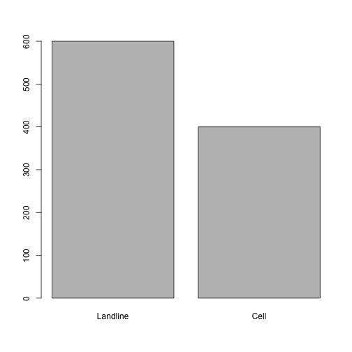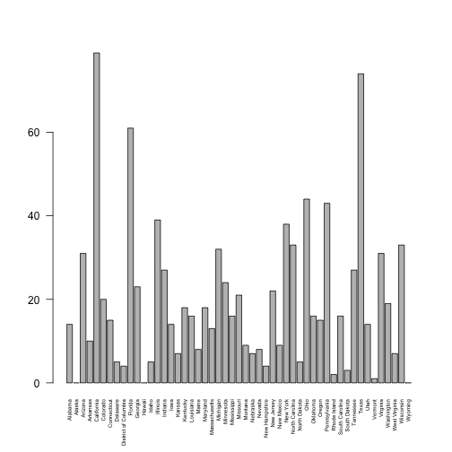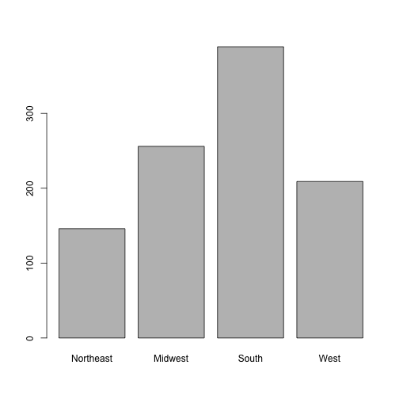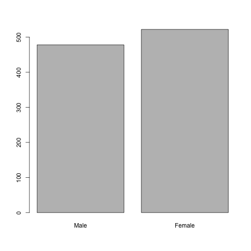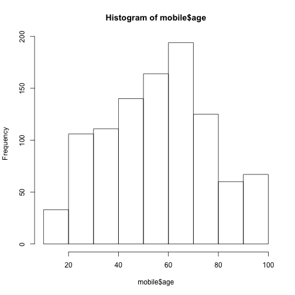
Survey Question Analyisis
========================================================

#INTUSE	Do you use the internet, at least occasionally? {PIAL Trend}
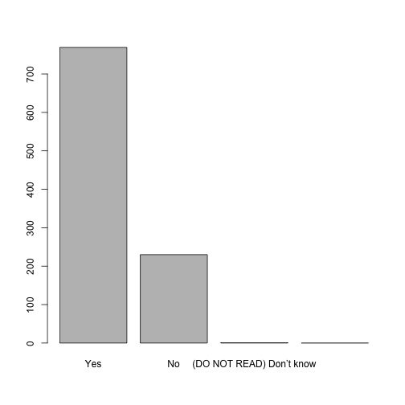
#EMLOCC	Do you send or receive email, at least occasionally? {PIAL Trend}
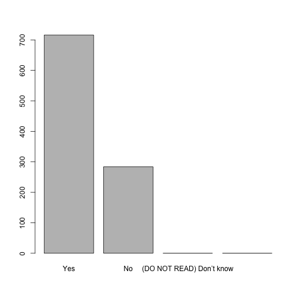
#If INTUSE=Yes or EMLOCC=Yes:
#HOME3NW	Do you ever use the internet or email at HOME? {PIAL Trend modified}
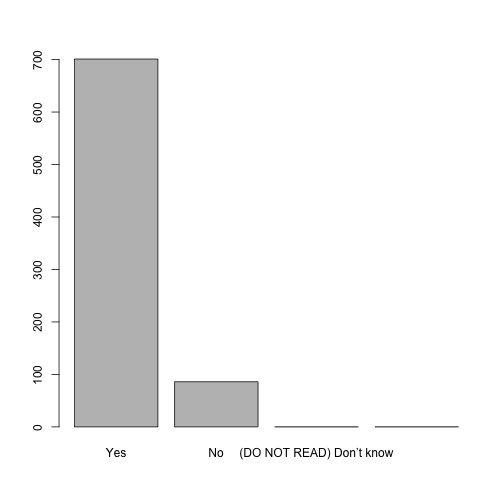
#If HOME3NW=Yes:
#MODEM3B 	At home, do you connect to the internet through a dial-up telephone line, or do you have some other type of connection, such as a DSL-enabled phone line, a cable TV modem, a wireless connection, a fiber optic connection such as FIOS (F-EYE-os) or a T-1?
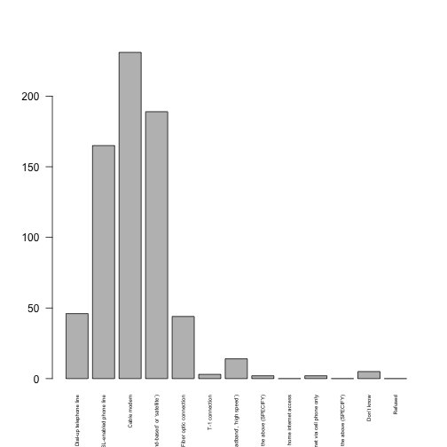

#If INTUSE=Yes or EMLOCC=Yes:
#TW	Do you ever use Twitter? {PIAL Trend}
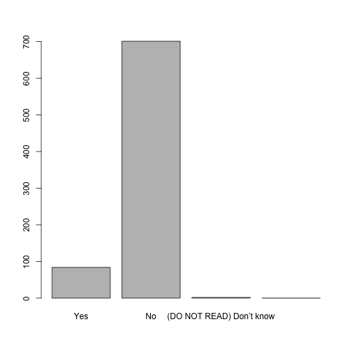

#ASK ALL INTERNET USERS (INTUSE=1 or EMLOCC=1):
#SNS	Do you ever use a social networking site like Facebook, LinkedIn or Google Plus? {Modified PIAL Trend}
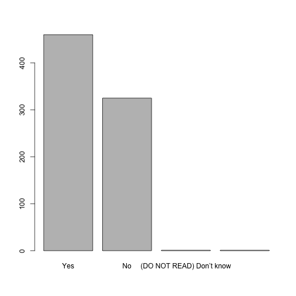
#Q10	As I read the following list of items, please tell me if you happen to have each one, or not.  Do you have... [INSERT ITEMS IN ORDER]? {Modified PIAL Trend}
#ASK ITEM a IF LANDLINE SAMPLE (SAMPLE=1)
#a.	A cell phone... or a Blackberry or iPhone or other device that is also a cell phone {QL1}
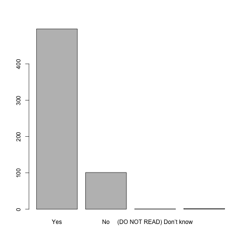
#b.	A handheld device made primarily for e-book reading, such as a Nook or Kindle e-reader {EBOOKHV} {modified trend}
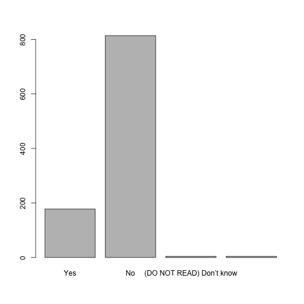
#c.	A tablet computer like an iPad, Samsung Galaxy, Motorola Xoom (Pronounced: “zoom”), or Kindle Fire {IPADHV} {modified trend}

#ASK IF CELL OWNER (Q10a=1 OR SAMPLE=2)
#Q11	Do you ever use your cell phone to make a CHARITABLE donation by text message?
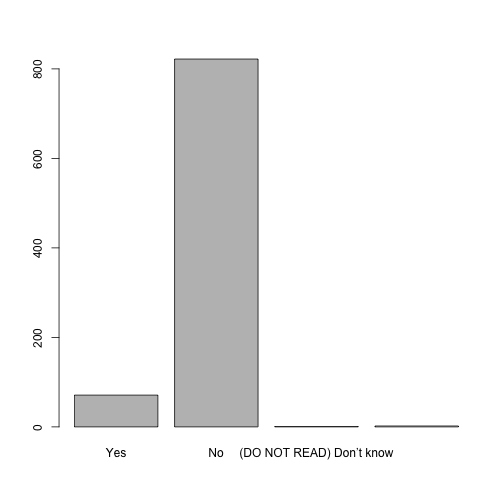
#ASK IF CELL OWNER (Q10a=1 OR SAMPLE=2)
#Q12	In the last 30 days, have you used your cell phone to do the following? (First,) in the last 30 days, have you used your cell phone to...[INSERT IN ORDER]? {New}
#a. 	Call a friend while you were in a store for advice about a purchase you were considering making
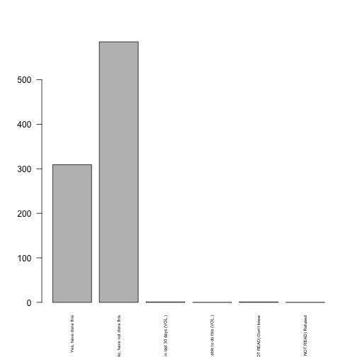
#b.	Look up REVIEWS of a product while you were in a store, to help you decide if you should purchase it
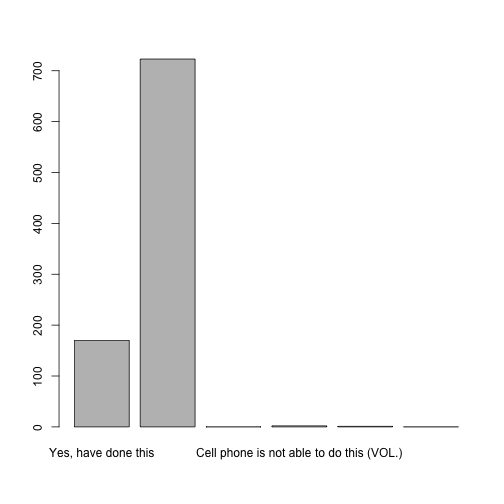
#c.	Look up the price of a product online while you were in a store, to see if you could get a better price somewhere else
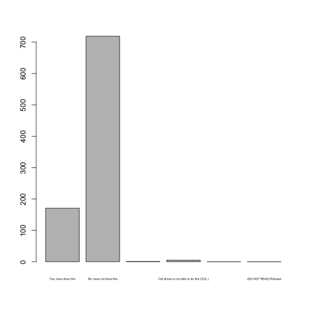
#d.	Scan a product bar code to get more information or compare prices on something you were thinking of purchasing
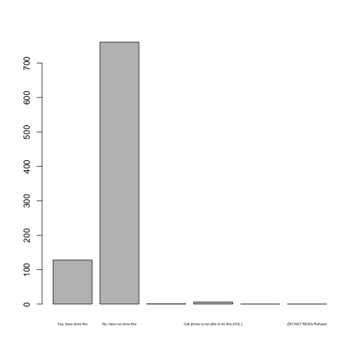
#e.	Purchase a product in a store using a coupon you downloaded to your phone
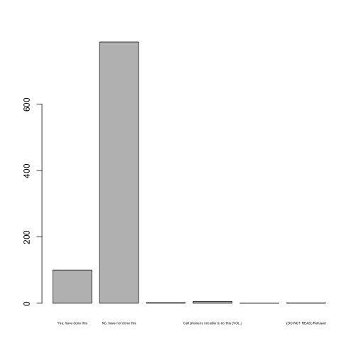

#ASK IF HAVE LOOKED UP PRICES USING PHONE (Q12c=1)
#Q13	Thinking of the most recent time you used your cell phone to look up prices on a product while you were in a store, did you end up purchasing the product?
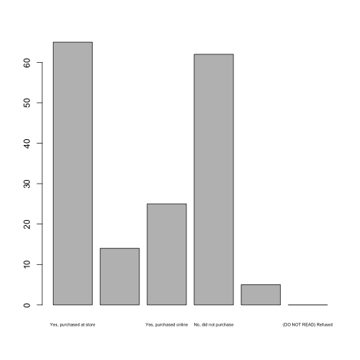
