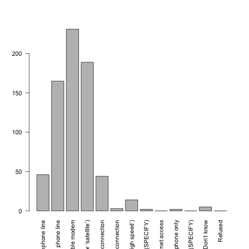

Pewdata Package Rstudio Presentation
========================================================
author: Adam Glover
date: 12/26/16
autosize: true

Introduction
========================================================
This presentation will cover usage of pewdata package in R and exploratory research of Pew Research Center Mobile Commerce Questionaire


Pewdata
========================================================
Pew Research allows users to download data referenced in articles on the website. The follwing dataset measures mobile commerce. 

```r
# install package Hmisc. This will allow me to interact with the .sav file
library(Hmisc)
# assign the file path to mobile using the function spss.get
mobile <- spss.get('/Users/ag/Desktop/pew_data/Mobile.sav', use.value.labels=TRUE)
# view table columns
names(mobile)
```

```
 [1] "psraid"   "sample"   "int.date" "state"    "cregion"  "usr"     
 [7] "intuse"   "emlocc"   "home3nw"  "modem3b"  "tw"       "sns"     
[13] "pial10a"  "pial10b"  "pial10c"  "pial11"   "pial12a"  "pial12b" 
[19] "pial12c"  "pial12d"  "pial12e"  "pial13"   "ql1a"     "qc1"     
[25] "hh1"      "employ"   "par"      "sex"      "age"      "educ"    
[31] "hisp"     "race"     "inc"      "reg"      "party"    "partyln" 
[37] "zipcode"  "weight"   "standwt" 
```

Summary of dataset
========================================================
# summary(mobile) This command doesn't provide a visually pleasing understanding of the dataset.

Exploratory Research - Demographics
========================================================

Survey Question Analyisis
========================================================

